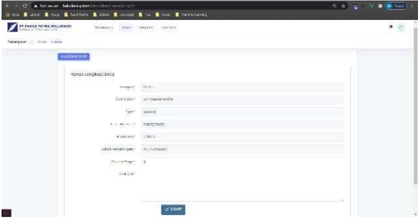

# **Tugas-KPPL-Week-4**

**Nama**: Adyuta Prajahita Murdianto

**NRP**: 5025221186

**Kelas**: KPPL E

Cari paper/ atau TA yang berhubungan dengan Technical Support System, kemudian buatlah resumenya

## **Judul**

[HELPDESK SYSTEM UNTUK TECHNICL SUPPORT BERBASI HYBRID PADA PT.PANCA PUTRA SOLUSINDO](https://jurnal.umj.ac.id/index.php/just-it/article/download/13590/7230)

Jurnal ini membahas tentang pengembangan sistem helpdesk berbasis hybrid di PT. Panca Putra Solusindo, sebuah perusahaan yang bergerak di bidang IT Solution. Perusahaan ini menangani layanan perawatan dan penyewaan perangkat teknologi kepada berbagai klien. Dalam menjalankan operasionalnya, perusahaan menghadapi tantangan terkait keluhan dan permintaan klien yang sebelumnya dikelola secara manual melalui email dan telepon. Sistem manual ini sering menyebabkan keterlambatan dalam penanganan keluhan dan terkadang terjadi kesalahan pencatatan, seperti kehilangan unit yang disewa. Untuk mengatasi masalah tersebut, penulis merancang sebuah sistem helpdesk berbasis hybrid, yang memadukan kelebihan aplikasi web dan aplikasi native. Sistem ini diharapkan dapat mempermudah penanganan keluhan, mempercepat proses layanan, serta meningkatkan efisiensi operasional perusahaan.

## **Tujuan**

1. `Mempercepat proses penanganan keluhan`: Sistem helpdesk yang dirancang bertujuan untuk meminimalisir keterlambatan dalam merespon keluhan klien yang sebelumnya dilakukan melalui email dan telepon.
   
2. `Mengurangi kesalahan pencatatan`: Sistem ini diharapkan dapat mengatasi masalah hilangnya unit yang disewa karena pencatatan manual, dengan menyediakan pencatatan digital yang lebih terorganisir.

3. `Mempermudah pelacakan status keluhan dan permintaan`: Dengan adanya fitur pelacakan yang terintegrasi, admin dan teknisi bisa dengan mudah memantau perkembangan setiap tiket keluhan atau permintaan klien.
   
4. `Mengintegrasikan permintaan unit dan keluhan ke dalam satu sistem`: Sistem ini memungkinkan klien untuk mengajukan permintaan unit dan keluhan sekaligus, sehingga mengurangi proses manual dan mempercepat alur kerja.

5. `Menggunakan teknologi hybrid untuk efisiensi`: Dengan menerapkan aplikasi berbasis hybrid, perusahaan bisa mendapatkan keuntungan dari aplikasi yang bisa berjalan di berbagai platform tanpa perlu pengembangan khusus untuk masing-masing platform.

## **Metodologi**

Sistem helpdesk ini dikembangkan dengan menggunakan metode Waterfall, yang melibatkan beberapa tahapan sebagai berikut:

- `Analisis`: Tahap awal ini digunakan untuk mengumpulkan informasi mengenai sistem yang sedang berjalan, apa saja kekurangannya, serta kebutuhan dari pengguna sistem.

- `Perancangan (Design)`: Setelah analisis, dilakukan perancangan sistem dengan memanfaatkan use case, relasi antar tabel, diagram konteks, dan diagram aktivitas.

- `Pengkodean (Coding)`: Setelah rancangan selesai, pengembangan dilakukan menggunakan framework Laravel untuk bagian backend, Vue.js untuk frontend, dan basis data MySQL.

- `Pengujian (Testing)`: Pengujian dilakukan menggunakan metode Black Box untuk memastikan bahwa semua fungsi dalam sistem berjalan sesuai harapan.

## **Hasil**

**Login**

Pada halaman login, admin helpdesk, klien, serta super admin dapat memasukkan username dan password mereka untuk mengakses sistem. Sementara itu, tampilan halaman login untuk teknisi memiliki perbedaan tersendiri yang disesuaikan dengan peran mereka dalam sistem.

**Dashboard**

Di halaman dashboard, admin, klien, dan super admin dapat melihat berbagai informasi, seperti jumlah tiket keluhan yang masuk, jumlah tiket yang sudah diselesaikan, serta jumlah permintaan unit yang diajukan.

**Membuat Laporan**

Halaman untuk mengelola pelaporan masalah dari perspektif klien, di mana laporan tersebut nantinya akan diteruskan kepada admin untuk ditindak lanjuti.

**Tindakan Teknisi**

Halaman yang memperlihatkan langkah-langkah yang diambil oleh teknisi dalam menyelesaikan masalah yang dilaporkan oleh klien.

## **Kesimpulan**

Berdasarkan implementasi dan uji coba yang telah dilakukan, dapat diambil beberapa kesimpulan. Pertama, dengan adanya sistem helpdesk ini, klien sekarang bisa lebih mudah mengajukan permintaan unit atau melaporkan masalah secara langsung melalui sistem, yang terhubung langsung dengan admin helpdesk. Kedua, proses yang sebelumnya dilakukan melalui telepon dan email kini jauh lebih efisien, karena sistem baru ini mampu menyimpan riwayat pekerjaan sehingga memudahkan pelacakan dan penanganan masalah di kemudian hari.

## **Saran**

Ada beberapa saran pengembangan yang bisa diterapkan untuk meningkatkan sistem ke depannya. Pertama, penting untuk melakukan pengembangan dan pemeliharaan secara berkala terhadap sistem dan perangkat lunak yang ada, agar sistem ini dapat terus berjalan dengan optimal dan sesuai dengan kebutuhan perusahaan. Kedua, sistem ini juga bisa ditingkatkan dengan menambahkan elemen-elemen khusus perusahaan, seperti logo dan alamat perusahaan, untuk memberikan sentuhan yang lebih personal. Terakhir, bagi peneliti atau pengembang di masa depan, diharapkan mereka dapat terus menyempurnakan sistem ini agar menjadi lebih baik dan sesuai dengan kebutuhan yang terus berkembang.